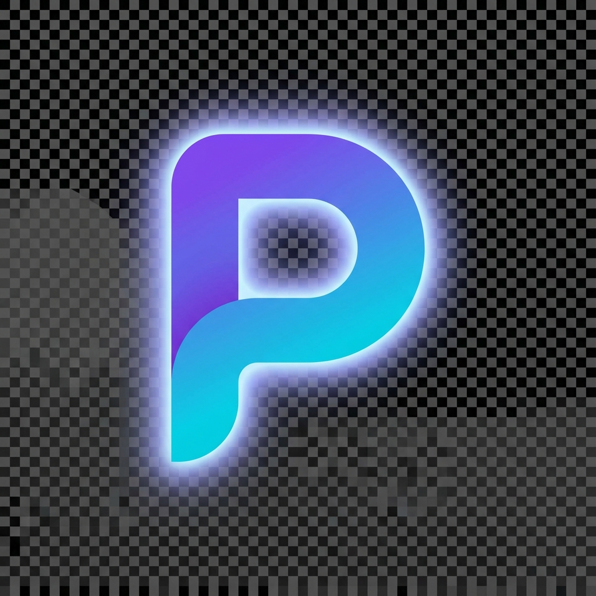

<p align="center">
  
</p>

<h1 align="center">Pub</h1>

<p align="center">
  <strong>Publish Everywhere, Instantly</strong>
</p>

<p align="center">
  The ultimate social media distribution platform. One click to publish your content across TikTok, Instagram, YouTube, Twitter, and more.
</p>

<p align="center">
  <a href="#features">Features</a> •
  <a href="#tech-stack">Tech Stack</a> •
  <a href="#getting-started">Getting Started</a> •
  <a href="#project-structure">Structure</a> •
  <a href="#deployment">Deployment</a>
</p>

---

## ✨ Features

- **🚀 One-Click Publishing** - Upload once, publish everywhere
- **📅 Smart Scheduling** - AI-powered optimal posting times
- **📊 Unified Analytics** - Track all platforms in one dashboard
- **🎨 Format Adaptation** - Auto-resize for each platform
- **🔄 Queue Management** - Set it and forget it
- **🛡️ Account Safety** - Human-like behavior patterns

### Supported Platforms

| Platform | Status |
|----------|--------|
| TikTok | ✅ Ready |
| Instagram | ✅ Ready |
| YouTube | ✅ Ready |
| Twitter/X | ✅ Ready |
| Facebook | ✅ Ready |
| LinkedIn | ✅ Ready |
| Pinterest | ✅ Ready |

---

## 🛠️ Tech Stack

| Layer | Technology |
|-------|-----------|
| **Framework** | Next.js 14 (App Router) |
| **Language** | TypeScript |
| **Styling** | TailwindCSS |
| **Animations** | Framer Motion |
| **Database** | Supabase (PostgreSQL) |
| **Auth** | Supabase Auth |
| **Payments** | Polar.sh |
| **Hosting** | Vercel |

---

## 🚀 Getting Started

### Prerequisites

- Node.js 18+
- npm or yarn
- Supabase account (optional for development)

### Installation

```bash
# Clone the repository
git clone https://github.com/DevKursat/pub.git
cd pub

# Install dependencies
npm install

# Start development server
npm run dev
```

Open [http://localhost:3000](http://localhost:3000) in your browser.

### Environment Variables

Create a `.env.local` file:

```env
# Supabase (required for auth)
NEXT_PUBLIC_SUPABASE_URL=your_supabase_url
NEXT_PUBLIC_SUPABASE_ANON_KEY=your_supabase_anon_key
SUPABASE_SERVICE_ROLE_KEY=your_service_role_key

# Polar.sh (required for payments)
POLAR_ACCESS_TOKEN=your_polar_token
POLAR_WEBHOOK_SECRET=your_webhook_secret

# Optional - Platform APIs
TIKTOK_CLIENT_KEY=
INSTAGRAM_USERNAME=
YOUTUBE_API_KEY=
TWITTER_API_KEY=
```

---

## 📁 Project Structure

```
pub/
├── app/
│   ├── (auth)/              # Auth pages (login, register)
│   ├── (dashboard)/         # Dashboard pages
│   │   ├── dashboard/       # Main dashboard
│   │   └── layout.tsx       # Dashboard layout with sidebar
│   ├── globals.css          # Global styles & design system
│   ├── layout.tsx           # Root layout with fonts
│   └── page.tsx             # Landing page
│
├── components/
│   ├── ui/                  # Reusable UI components
│   │   ├── button.tsx
│   │   ├── card.tsx
│   │   ├── input.tsx
│   │   ├── modal.tsx
│   │   ├── toast.tsx
│   │   └── ...
│   ├── marketing/           # Landing page components
│   │   ├── hero.tsx
│   │   ├── features.tsx
│   │   ├── pricing.tsx
│   │   └── ...
│   └── dashboard/           # Dashboard components
│       ├── sidebar.tsx
│       ├── header.tsx
│       └── stats-card.tsx
│
├── lib/
│   └── utils.ts             # Utility functions
│
├── tailwind.config.ts       # Design system configuration
└── package.json
```

---

## 🎨 Design System

The project uses a premium dark theme with glassmorphism effects:

### Colors

| Token | Value | Usage |
|-------|-------|-------|
| `primary` | `#8b5cf6` | Buttons, links, accents |
| `accent` | `#06b6d4` | Secondary accents |
| `success` | `#10b981` | Positive states |
| `warning` | `#f59e0b` | Warning states |
| `error` | `#ef4444` | Error states |
| `background` | `#09090b` | Main background |

### Components

All components support Framer Motion animations and follow a consistent API:

```tsx
import { Button, Card, Input, Badge, Avatar } from '@/components/ui';

// Button variants
<Button variant="primary">Primary</Button>
<Button variant="secondary">Secondary</Button>
<Button variant="ghost">Ghost</Button>

// Card variants
<Card variant="glass">Glass effect</Card>
<Card variant="gradient">Gradient border</Card>
<Card hover>Hover animation</Card>
```

---

## 📦 Deployment

### Vercel (Recommended)

1. Push to GitHub
2. Connect repo to Vercel
3. Add environment variables
4. Deploy!

```bash
# Push to GitHub
git add .
git commit -m "Initial commit"
git push origin main
```

### Build

```bash
# Production build
npm run build

# Start production server
npm start
```

---

## 📄 License

MIT License - feel free to use for personal or commercial projects.

---

<p align="center">
  Built with ❤️ for creators worldwide
</p>
